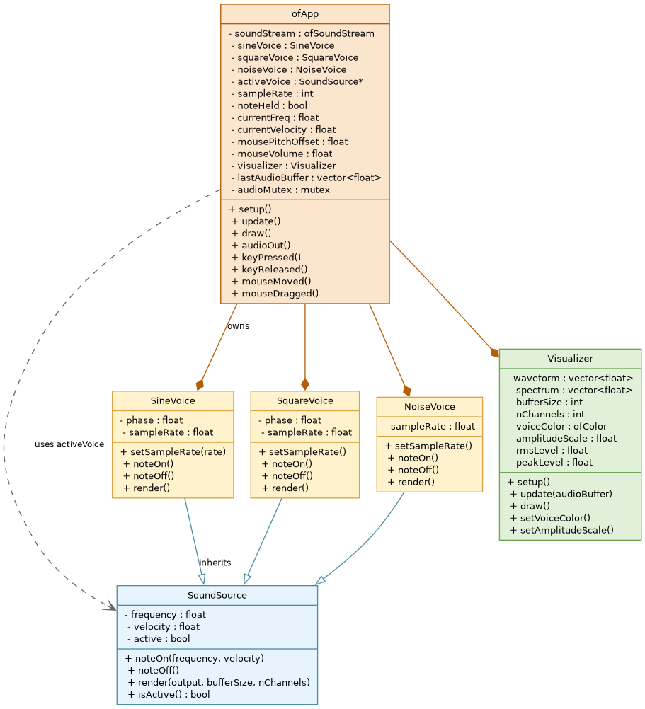

# Overview

## What Synther Is

Synther is an interactive software synthesizer built with openFrameworks. It generates audio in real time, responds to keyboard and mouse input, and displays the resulting waveform and spectrum.

The application is a small and focused instrument with three distinct voices, direct keyboard control for notes, mouse control for fine pitch and volume adjustments, and a lightweight visualizer that helps the player understand what is being heard.

Synther is structured as a clean object-oriented program. Audio generation, visualization, and application control are separated into distinct classes with clear relationships. This keeps each part testable and makes future extensions straightforward.

# Features

## Sound

Three voices inherit from a common interface SoundSource:

* **Sine** - smooth tone from a phase accumulator, suitable as lead.
* **Square** - bright tone from the sign of the phase, first half cycle high, second low.
* **Noise** - white noise, uniform in -1 to 1, for percussion and texture.

Only one voice is active at a time. Switching voices retriggers a held note on the new voice so the change is audible immediately.

## Interaction

| Input | Mapping |
|-------|---------|
| 1, 2, 3 | Select Sine, Square, Noise |
| A S D F G H J K L | Play C4, D4, E4, F4, G4, A4, B4, C5, D5 (261.63 to 587.33 Hz) |
| Release mapped key | Stop note |
| Mouse X | Pitch offset -20 Hz (left) to +20 Hz (right) |
| Mouse Y | Volume 1.0 (top) to 0.0 (bottom), applied at note-on |
| Mouse drag | Same mapping as move, for continuous control |

Pitch offset is applied at trigger time and clamped to keep frequency above 20 Hz. Velocity is clamped to 0 to 1. The HUD shows the current offset, volume, and playing frequency.

## Visualization

Visualizer draws three elements:

1. **Waveform** - centered trace of the last audio buffer, colored by voice (Sine teal, Square amber, Noise grey) and scaled by note velocity.
2. **Amplitude bar** - right edge, RMS fill with peak tick.
3. **Spectrum** - bottom 64 bars, lightweight DFT over 256 samples, normalized and scaled for display.

The visualizer receives a thread-safe copy of the last rendered buffer via a mutex.

# How to Build and Run

## Requirements

* openFrameworks 0.12 or later (tested on Linux 64-bit)
* make toolchain and a C++17 compiler
* Audio output device

Repository layout follows openFrameworks app conventions:

```
apps/myApps/Synther/
  src/            # SineVoice, SquareVoice, NoiseVoice, SoundSource, Visualizer, ofApp, main
  bin/data/       # placeholder for samples
  docs/           # manual.md, requirements.md, workflow.md, PDF
  README.md
  Makefile, config.make, addons.make, .gitignore
```

## Build

```bash
cd apps/myApps/Synther
make -j4
```

## Run

```bash
make RunRelease
# or
bin/Synther
```

If no sound is heard, check system volume, select Sine with 1, and hold A. Move the mouse to the top of the window for full volume.

## Troubleshooting

* **No audio or soundStream error:** close other apps using audio, check system audio settings.
* **Clicks or clipping:** keep bufferSize at 256. Voices reset phase at noteOn to reduce pops.
* **Window not responding:** ensure the Synther window has focus for keyboard input.

# How to Use

1. Launch Synther. The window shows Synther - Sine Voice [Capricorn] and key hints.
2. Press 1, 2, or 3 to choose a voice.
3. Hold A S D F G H J K L to play C4 to D5. The status line shows frequency and velocity.
4. Move the mouse horizontally to tune pitch by +/-20 Hz for the next note. Move vertically to set volume.
5. Observe the waveform color, amplitude bar, and spectrum at the bottom.
6. Release the key to stop the note.

Tip shown in the app: top is loud, bottom is quiet, left is -20 Hz, right is +20 Hz.

# Architecture

## Classes

| Class | File | Role |
|-------|------|------|
| SoundSource | src/SoundSource.h | Abstract base with noteOn, noteOff, render, and shared frequency, velocity, active state |
| SineVoice | src/SineVoice.h | Sine wave via phase accumulator |
| SquareVoice | src/SquareVoice.h | Square wave via sign of phase |
| NoiseVoice | src/NoiseVoice.h | White noise, uniform random sample |
| Visualizer | src/Visualizer.h | Stores mono waveform, computes RMS and peak and DFT, draws views |
| ofApp | src/ofApp.h | Application that owns the stream, voices, visualizer, input handling, and threading |

ofApp is the composition root. It creates the sound stream, holds the three voice instances, and holds the visualizer.

## Relationships

**Inheritance**

SoundSource is the abstract interface. Each voice overrides noteOn, noteOff, and render:

```
SoundSource <|-- SineVoice
SoundSource <|-- SquareVoice
SoundSource <|-- NoiseVoice
```

This allows ofApp to hold a SoundSource pointer for the active voice and switch voices without changing caller code. Polymorphism is the reason for inheritance here.

**Composition**

ofApp composes the system:

```
ofApp *-- SineVoice
ofApp *-- SquareVoice
ofApp *-- NoiseVoice
ofApp o-- SoundSource (activeVoice pointer)
ofApp *-- Visualizer
ofApp *-- ofSoundStream
ofApp *-- mutex and vector for lastAudioBuffer
Visualizer *-- waveform and spectrum vectors
```

Visualizer is owned by ofApp and updated each frame with a copy of the audio buffer. SoundSource does not own the audio thread, ofApp drives it.

These are the two required OOP relationships: inheritance for voice variety and composition for system assembly.

## Class Diagram



*Figure: Class diagram for Synther. SoundSource is the abstract base. SineVoice, SquareVoice, and NoiseVoice inherit from it. ofApp owns the three voices, the visualizer, and the audio stream, and uses the active voice through a SoundSource pointer.*

Future extensions such as an ADSR envelope or a sample voice can be added without changing ofApp, because they would use the same SoundSource interface.

## Data Flow

1. setup configures 44.1 kHz, 2 channels, 256 frames, and prepares the Visualizer.
2. keyPressed sets the current frequency and velocity with mouse scaling, then calls activeVoice->noteOn.
3. The audio thread calls audioOut, which clears the buffer, asks the active voice to render, and stores a copy under lock.
4. The main thread update copies the buffer, updates voice color and amplitude scale, and calls visualizer.update.
5. draw calls visualizer.draw and then overlays text.

# Implementation Notes

## ofSoundStream and audioOut

ofSoundStreamSettings selects this app as output listener. soundStream.setup starts the audio thread. openFrameworks then calls audioOut repeatedly.

audioOut gets the interleaved float array, fills it with silence first, then delegates to the active voice. Rendering must be fast (256 frames at 60 fps leaves little headroom), so each voice writes directly into the provided buffer without allocation.

## Sample Generation Basics

* **Rate:** 44100 Hz. Phase increment per sample is 2 * pi * frequency / sampleRate.
* **Sine:** sample is sin(phase) * velocity, phase advanced and wrapped in 0 to 2pi.
* **Square:** sample is (sin(phase) >= 0 ? 1 : -1) * velocity.
* **Noise:** sample is random value in -1 to 1 * velocity.
* Each render loops over frames, computes one mono sample, and replicates it to all channels in interleaved layout.

Buffer handling is minimal: one active voice renders, thread-safe copy for visuals. This keeps clicks low. Phase is reset at noteOn so successive notes start at zero.

## Visualization Computation

Visualizer update takes the interleaved buffer, extracts the first channel into waveform, computes RMS and peak, and runs a naive DFT for 64 spectrum bars. DFT is normalized by buffer size and boosted for visibility, then clamped to 0 to 1.

# Appendix

## Repository Structure

```
Synther/
  src/
    SoundSource.h and .cpp   # abstract voice interface
    SineVoice.h and .cpp     # sine wave
    SquareVoice.h and .cpp   # square wave
    NoiseVoice.h and .cpp    # white noise
    Visualizer.h and .cpp    # waveform, amplitude, spectrum
    ofApp.h and .cpp         # app, input, audio thread
    main.cpp
  bin/
    data/                    # placeholder for samples
  docs/
    manual.md                # source for this PDF
    requirements.md          # software requirements
    workflow.md              # early workflow sketch
    Synther_Project_Description_Manual.pdf
  README.md
  Makefile, config.make, addons.make, .gitignore
```

Project branches in this repository:

```
main                             # base, tracks origin/main
phase-2-sine-voice               # single voice prototype, sine
phase-3-additional-voices        # added square and noise, voice switching
phase-4-visualization            # basic waveform
phase-4b-enhanced-visualization  # color, amplitude bar, spectrum
phase-5-interaction              # mouse pitch offset and volume
phase-6-documentation            # this manual, PDF, README, requirements
```

Remote also contains `origin/Basic-keys` (separate experiment, not part of the main phase sequence) and `origin/master` which is the default remote HEAD.

## References

* openFrameworks ofSoundStream documentation
* openFrameworks ofSoundBuffer documentation

