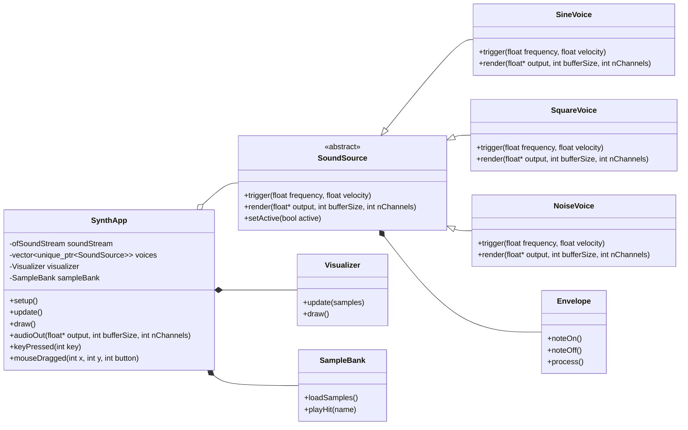
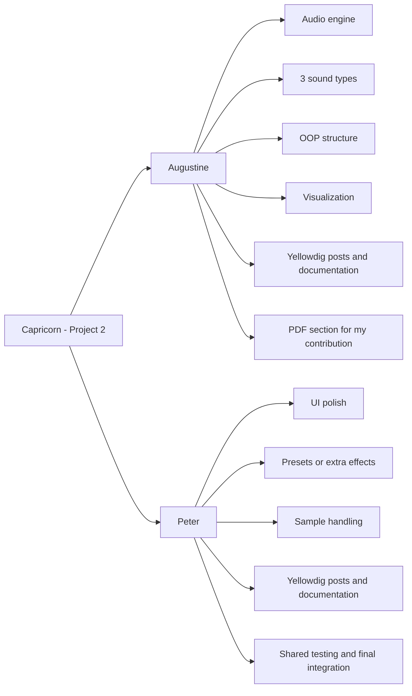

# Project Workflow

```mermaid
classDiagram
direction LR

class SynthApp {
  -ofSoundStream soundStream
  -vector~unique_ptr~SoundSource~~ voices
  -Visualizer visualizer
  -SampleBank sampleBank
  +setup()
  +update()
  +draw()
  +audioOut(float* output, int bufferSize, int nChannels)
  +keyPressed(int key)
  +mouseDragged(int x, int y, int button)
}

class SoundSource {
  <<abstract>>
  +trigger(float frequency, float velocity)
  +render(float* output, int bufferSize, int nChannels)
  +setActive(bool active)
}

class SineVoice {
  +trigger(float frequency, float velocity)
  +render(float* output, int bufferSize, int nChannels)
}

class SquareVoice {
  +trigger(float frequency, float velocity)
  +render(float* output, int bufferSize, int nChannels)
}

class NoiseVoice {
  +trigger(float frequency, float velocity)
  +render(float* output, int bufferSize, int nChannels)
}

class Envelope {
  +noteOn()
  +noteOff()
  +process()
}

class Visualizer {
  +update(samples)
  +draw()
}

class SampleBank {
  +loadSamples()
  +playHit(name)
}

SoundSource <|-- SineVoice
SoundSource <|-- SquareVoice
SoundSource <|-- NoiseVoice

SynthApp *-- Visualizer
SynthApp *-- SampleBank
SynthApp o-- SoundSource
SoundSource *-- Envelope
```

# Team Split

```mermaid
flowchart LR
A[Capricorn - Project 2] --> B[Augustine]
A --> C[Peter]

B --> B1[Audio engine]
B --> B2[3 sound types]
B --> B3[OOP structure]
B --> B4[Visualization]
B --> B5[Yellowdig posts and documentation]
B --> B6[PDF section for my contribution]

C --> C1[UI polish]
C --> C2[Presets or extra effects]
C --> C3[Sample handling]
C --> C4[Yellowdig posts and documentation]
C --> C5[Shared testing and final integration]
```
